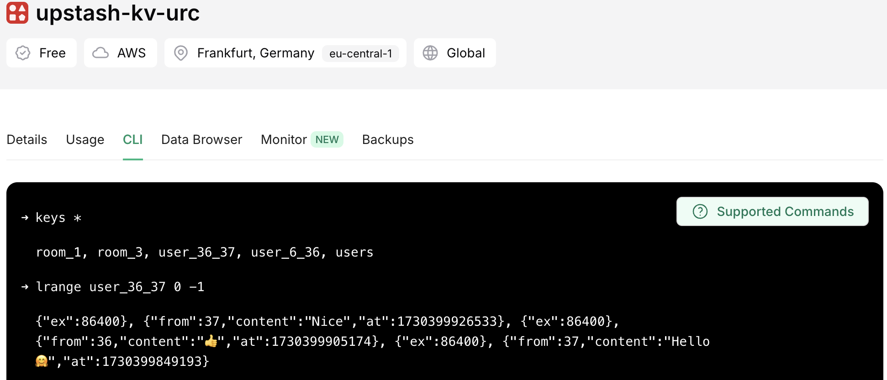

# UBO Relay Chat

[Lien du cours](https://docs.google.com/presentation/d/1p-KtmWjFnfrZP-NrXgGACX2TSRNJXMdJ)

## Objectifs

Créer une application de messagerie type IRC / WhatApp : [démo](https://urc.vercel.app/)

TP réalisable en binômes ; mais dans ce cas, je veux un accès au repos Git pour vérifier la contribution équitable de chacun.

Le but de ce TP est de fournir un cadre permettant l'exploration et l'expérimentation.
A vous de vous plonger dans la documentation des différents outils utilisés (Redis, Node.js, Crypto, Push API) pour comprendre leur fonctionnement et les prendre en main.
La poursuite d'idées personnelles et l'ajout de fonctionnalités additionnelles sont vivement encouragées.


## Intro

Pour réaliser ce TP, nous allons utiliser la plateforme [vercel](https://vercel.com/dashboard) qui propose différents supports de stockage de données : 

 - Une base de données relationnelle de type PostgreSQL pour stocker nos utilisateurs
 - Un cache de type Redis pour gérer les sessions utilisateurs (vérifier qu'ils se sont bien connectés)
 - Un stockage fichier de type bucket s3, afin d'héberger les images (et GIF) envoyés dans les conversations


## Setup

- Installer la dernière version de Node.js depuis le [site web](https://nodejs.org/en/download)
- ⚠️ Les distributions Ubuntu contiennent généralement une version obsolète dans leur repos, donc la commande `apt-get install` ne permet pas de récupérer une version récente.
- Forker le template du projet et le versionner sur Git.
- L'intéger à [vercel](https://vercel.com/dashboard)
- Instancier sur vercel 2 [stores](https://vercel.com/dashboard/stores) : une base de données Néon (PostgreSQL) et un cache Upstash KV (basé sur Redis)
- Depuis l'onglet `storage` de son projet, connecter les 2 stores afin qu'ils soient accessibles par l'application
- Vérifier dans l'onglet `Settings/Environment Variables` que toutes les infos de connexion aux stores sont bien présentes
- Depuis la BDD "Neon", cliquer sur le bouton `Open in Neon`, puis sur l'onglet `SQL Editor`, afin d'avoir accès à une console SQL en ligne.
- Exécuter les requêtes présentes dans le fichier [scripts/db.sql](scripts/db.sql))
- Installer le [CLI](https://vercel.com/docs/cli) et le lier au projet local via la commande `vercel link`
- Récupérer la configuration des DBs créées en local : `vercel env pull .env.development.local`
- Charger les variables d'environnement : `export $(cat .env.development.local | xargs)`
- Installer les dépendances du projet : `npm install` ou `yarn install`

Le projet peut à présent être exécuté en local, en se connectant au cache et la base de données distante,
avec la commande `vercel dev` 🎉

La requête présente dans le fichier [scripts/db.sql](scripts/db.sql) permet d'initialiser un utilisateur `test / testubo`.
Si tout est bon, il devrait permettre de se connecter sur l'ébauche de formulaire fourni.


### Structure du projet

Le template du projet est configuré avec `Typescript`.
Bien que son utilisation soit très vivement recommandée, elle n'est pas obligatoire.
D'expérience, tout le temps gagné en développant en JS est perdu en cherchant des bugs qui auraient
été évités en Typescript.<br/>
Le dossier `scripts` contient une requête SQL pour créer la table `users` permettant la gestion des utilisateurs.<br/>
Le dossier `api` contient les services "back" utilisés par l'application, qui sont exécutés en tant que
fonctions Serverless sur Vercel.

### Serverless

Vercel repose sur les services Amazon Web Services (AWS) qui constitue le principal hébergeur mondial.
La prise en main d'AWS est trop complexe et trop longue pour un TP. Heureusement, Vercel s'occupe de tout.

Au cours du setup, vous avez déjà pu créer une base de données et un cache en trois clics,
sans avoir faire d'installation ou à gérer des composants d'infrastructure.
De la même façon, le code serveur nécessaire à l'application sera exécuté dans des conteneurs NodeJs,
instanciés à la demande, sans avoir à gérer de serveur Web.

<p>&nbsp;</p>

## La gestion des utilisateurs

### La connexion

Le squelette d'application fourni contient déjà un formulaire de connexion basique.

Le service `/api/login` permet de récupérer un token de session qu'on stocke en session storage,
afin qu'il soit persisté lors d'un refresh du site. <br/>
Il est présent [ici](api/login.js).<br/>
Avant de passer à la suite, lire la note sur la [gestion du mot de passe](#mdp)

<a id="session"></a>
Contrairement à ce que vous avez peut-être déjà rencontré sur d'autres framework, ici la session utilisateur n'est pas gérée comme par magie
via des cookies, JSESSIONID ou autre.<br/>
Nous allons utiliser le schéma [Bearer Authentication](https://swagger.io/docs/specification/v3_0/authentication/bearer-authentication/) : 
ce sera à vous de gérer la persistance, au niveau du navigateur, du token de session récupéré lors de la connexion ; et d'envoyer ce token
en header de chaque requête, sous la forme `Authorization: Bearer <token>`, afin de pouvoir valider la connexion de l'utilisateur au niveau
des services API.

<p>&nbsp;</p>

Déroulé du service login : 

- On calcule le hash du mot de passe
- On fait un select en base pour chercher un couple username / password qui correspond
- Si on n'en trouve pas, on renvoie une erreur
- On met à jour la date de dernière connexion
- On génère un token aléatoire afin d'authentifier l'utilisateur
- On stocke ce token en cache avec une durée d'expiration de 3600s (1h)
- On stocke les infos de l'utilisateur en cache dans une Map indexée par son identifiant (peut être utile dans la suite du TP 😉).
- Pour finir, on retourne le token en réponse.
- 🚨 Ce token est à enregistrer au niveau de l'application React et il devra être envoyé lors de chaque
  appel API comme preuve de la connexion de l'utilisateur, sous la forme d'un header : `Authentication: Bearer le_token_reçu`.
  Le fichier [lib/session.js](lib/session.js) contient une fonction `checkSession()` permettant aux services API de vérifier que l'utilisateur est bien connecté et qu'il a le droit d'appeler ce service.


### ✏️ Let's get started

- Mettre en place un store : Redux Toolkit ou Zustand (par pitié, pas de Redux sans Toolkit)
- Intégrer `React Router` et déplacer le formulaire de connexion sur une page dédiée
- Ajouter la lib UX de votre choix ([comparatif 1](https://dev.to/fredy/top-5-reactjs-ui-components-libraries-for-2023-4673),
  [comparatif 2](https://www.wearedevelopers.com/magazine/best-free-react-ui-libraries#toc-5)) afin d'avoir du style ✨
- Personnaliser le formulaire de connexion pour le rendre plus attrayant


### ✏️ Ajouter de nouveaux utilisateurs

- Créer une nouvelle page et un nouveau composant avec un formulaire d'inscription contenant les champs :
  login, email et mot de passe.
- S'inspirer du service login.js pour créer un service permettant d'enregistrer un nouvel utilisateur.<br/>
  Celui-ci devra :
    - Contrôler que tous les champs sont bien renseignés
    - Vérifier qu'il n'existe pas déjà un utilisateur avec le même username ou le même email
    - Hasher le mot de passe
    - Générer un external_id (pour communiquer avec d'autres services, il est toujours utile d'avoir une référence utilisateur externe).
      Pour ça, utiliser la même fonction que pour le token de connexion : `crypto.randomUUID().toString()`
    - Enregistrer le tout en base
- Une fois le nouvel utilisateur enregistré, vous pouvez au choix : le rediriger vers la page de connexion
  ou le connecter automatiquement pour qu'il puisse accéder directement à la messagerie.
- Bonus : mettre également en place la déconnexion

<p>&nbsp;</p>

## La messagerie

 - ✏️ Créer 3 composants (au moins), pour gérer : 
   - La liste des utilisateurs et des salons (groupes de discussion) auxquels envoyer des messages
   - La liste des message correspondant au choix précédent
   - L'état global de la messagerie


### ✏️ Liste des utilisateurs

Le service [users.js](api/users.js) permet de vérifier que l'utilisateur est bien connecté et de récupérer la liste des utilisateurs existants (avec seulement leurs données publiques).

 - Utiliser ce service pour récupérer la liste des utilisateurs et l'enregistrer dans le store
 - Si vous obtenez une erreur 401 "UNAUTHORIZED", c'est que vous avez oublié de [mettre le token de session en header](#session).
 - Afficher la liste avec le nom de chaque utilisateur et sa date de dernière connexion 
(filtrer pour ne pas afficher dans la liste l'utilisateur connecté 😁)
 - Lors de la sélection d'un utilisateur, modifier l'URL (par exemple `/messages/user/{user_id}`),
de sorte à retomber sur la bonne discussion lors d'un F5 ou de l'accès au site directement par l'URL de la conversation ciblé.
(c'est une pratique courante pour gérer les clients qui mettent les pages en favoris du navigateur).
 - Stocker dans le store la conversation sélectionnée


### Envoi d'un message

Vercel offre 2 types de Functions : les [Serverless Functions](https://vercel.com/docs/functions/serverless-functions)
qui sont exécutées dans un environnement NodeJs classique ; et les [Edge Functions](https://vercel.com/docs/functions/edge-functions)
qui tournent sur un environnement Javascript allégé (pour de meilleurs performances).
Jusqu'à présent, la version Edge suffisait ; mais pour la gestion des messages, on aura besoin de la version Serverless.

Un exemple de squelette est fourni [message.js](api/message.js) et sera à compléter.<br/>
Plusieurs différences sont à noter :

 - La Serverless Function prend en paramètre un objet `reponse` sur lequel il faut appeler les fonctions `send()` ou `json()` pour renvoyer une réponse.
 - La récupération du payload change : `await request.body;` vs `await request.json()`

<p>&nbsp;</p>

#### Enregistrement des messages

Pour la démo, j'ai choisi de stocker les messages en cache, pendant 24h, en utilisant la fonction
Redis [LPUSH](https://vercel.com/docs/storage/vercel-kv/kv-reference#lpush).<br/>
Chaque conversation est stockée avec une clé permettant d'identifier les 2 utilisateurs concernés
(⚠️ Si la conversion concerne les utilisateurs A et B, elle doit pouvoir être retrouvée par chacun des 2).

Si vous préférez créer une table pour stocker les conversations en base de données, libre à vous.

✏️ Compléter le service d'enregistrement de message en fonction.

<p>&nbsp;</p>

#### ✏️ Liste des messages

Lors de la sélection d'un utilisateur, afficher la liste des messages échangés avec lui.

 - Adopter un affichage type conversation avec les messages reçus alignés à gauche et ceux envoyés alignés à droite.
 - Afficher l'émetteur et la date de chaque message.
 - Bonus : ajouter de l'auto-scroll pour toujours afficher les derniers messages.


## Salons de discussion

Discuter à 2, c'est bien ; en groupe, c'est mieux !

- Mettre en place une table en base de données pour stocker la liste des salons 
(pas obligé de suivre le format `rooms` fourni dans le [scripts/db.sql](scripts/db.sql))
- De même que pour les utilisateurs : récupérer et afficher la liste des salons
- Permettre l'envoi d'un message sur un salon
- Afficher la liste des messages d'un salon
- Gérer les notifications push à l'ensemble des membres d'un groupe

<p>&nbsp;</p>


## Notes

<a id="mdp"></a>
### La gestion du mot de passe
Même s'il s'agit d'un TP, pour faire les choses bien, on ne stocke pas de mots de passe en clair en base de données.
La convention est d'utiliser une fonction de hashage qui permet de calculer une empreinte du mot de passe,
afin qu'il ne soit pas possible de retrouver le mot de passe initial à partir de son empreinte.<br/>
A chaque connexion, on vient re-calculer le hash du mot de passe pour le comparer avec celui enregistré en base.

Par simplicité, on utilisera ici la fonction `SHA-256` qui est nativement supportée dans l'environnement JS ;
mais celle-ci n'est plus considérée comme sécurisée et une alternative plus robuste tel que `bcrypt` serait normalement à privilégier.

⚠️ Lors de la connexion, il peut être tentant de calculer le hash du mot de passe au niveau du navigateur, avant de l'envoyer au service de connexion,
afin qu'il ne soit pas en clair dans la requête.<br/>
Il s'agit d'une **très** mauvaise idée !
Un attaquant qui aurait réussi à récupérer le contenu de la base de données pourrait alors se connecter à la place de n'importe quel utilisateur
en envoyant directement le hash, sans avoir besoin de connaitre le vrai mot de passe.

2ème bonne pratique, on ne hash jamais un mot de passe seul. La concaténation avec un aléa unique
(dans le TP, il s'agit du username) permet de se prémunir des attaques de type [Rainbow table](https://fr.wikipedia.org/wiki/Rainbow_table).

Ainsi, dans l'exemple fourni dans [scripts/db.sql](scripts/db.sql), le login test / testubo se traduit
par le stockage en base de `gcrjEewWyAuYskG3dd6gFTqsC6/SKRsbTZ+g1XHDO10=`, que l'on peut vérifier avec la commande :
```bash
echo -n testtestubo | openssl sha256 -binary | base64
```

<p>&nbsp;</p>

### Chiffrement des messages

Le TP n'aborde pas la problématique de confidentialité des messages.<br/>
Les plus curieux auront pu découvrir (éventuellement au détour d'analyses de dugs) qu'il est possible de lister toutes
les conversations depuis l'interface CLI d'Upstash :



<p>&nbsp;</p>

#### Et dans la vraie vie, ça marche comment ?

Les applications de messagerie telles que WhatsApp utilisent du chiffrement de bout en bout, abrégé E2EE (pour End to End Encryption).<br/>
Les algorithmes utilisés reposent principalement sur le chiffrement asymétrique, qui permet de s'assurer que seul le destinataire sera capable de déchiffrer les messages envoyés.

Voici quelques ressources intéressantes :

- [Chiffrement et signature](https://medium.com/kobalt-si/chiffrement-et-signature-num%C3%A9rique-5798b1e1f8cf)
- [Protocol Signal](https://raw.githubusercontent.com/DanielArian/protocole-signal-explique/main/The%20Signal%20Protocol.pdf)


<p>&nbsp;</p>
